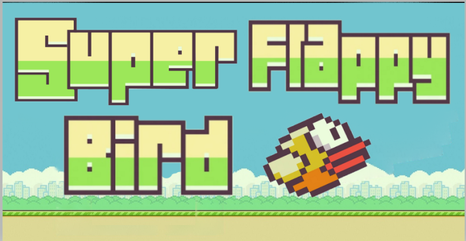
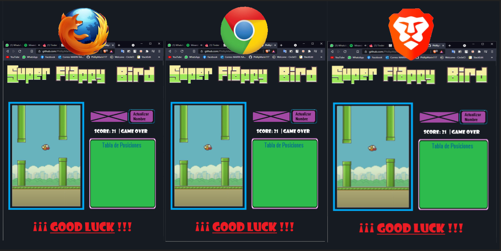
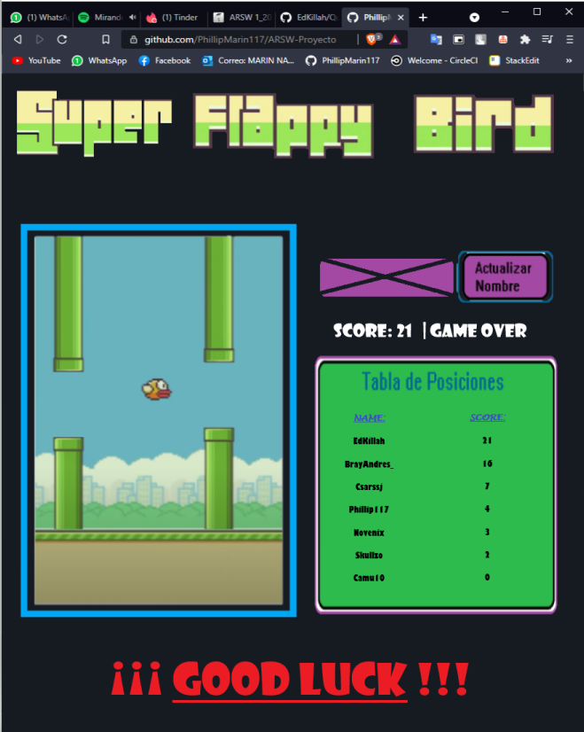
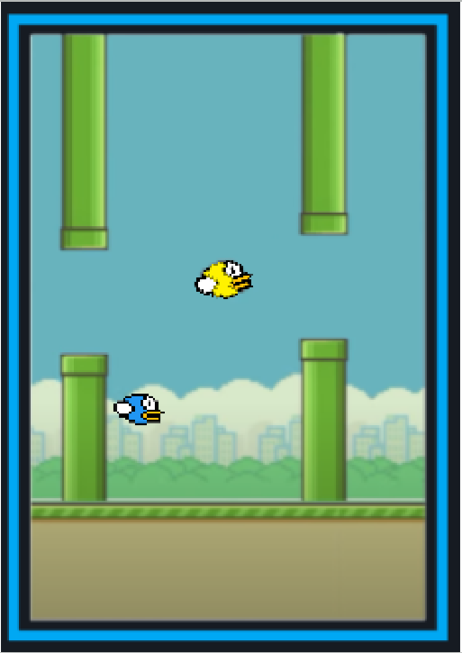
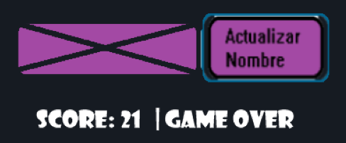
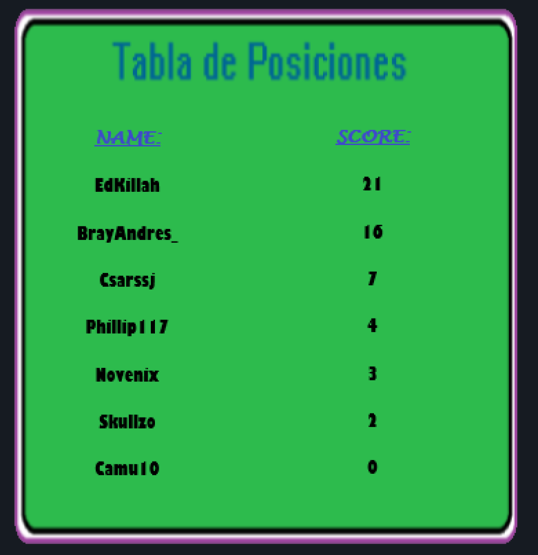
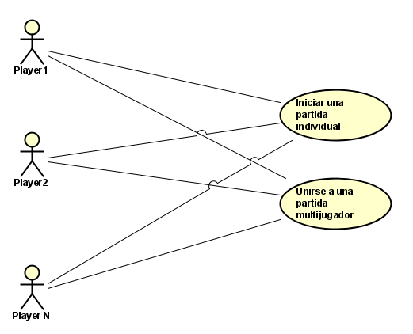
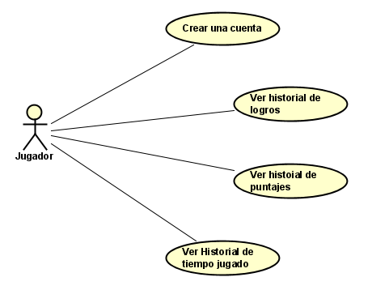

# 🐦 Super Flappy Bird 🐦

## 📚 Resumen 📚

Super Flappy Birds es un proyecto de la materia ARSW (Arquitectura de Software) el cual comenzará con su implementación en el periodo 2021-I.

Super Flappy Birds  está basado en el juego para dispositivos móviles y computadoras  **[Flappy Brids](https://flappybird.io/)** el cual es un juego de habilidad y destreza, y mucha... mucha... MUCHA PACIENCIA!!. 

## 🎮 Temática de juego 🎮

El juego y su temática es simple y fácil a primera vista, pero es mas complicado e lo que parece, consiste en lograr que un pajarito que salta pase por los obstáculos y así ir acumulando la mayor cantidad de puntos retando a los demás a llegar mas lejos, y obtener mas puntos... a medida que se  logre pasar mas allá de los niveles múltiplos de 10 (niveles 10, 20, 30, 40... etc) la velocidad del juego aumentará y obligará al usuario a pensar y actuar mas rápido poniendo a prueba su  habilidad para tomar acciones rápidas y precisas. Pero no crean que es tan fácil si quiera llegar al nivel 10. Ya que a medida de avanza los obstáculos cambian de tamaño y por ende el lugar por donde pasar esta cambiando a cada rato

## **💡 ¿Qué innovaciones aporta Super Flappy Bird? 💡**

Cómo se indicó anteriormente Flappy Birds es un juego que no cuenta con un multiplayer en donde varios  jugadores puedan entrar y ver tanto su propio progreso (Pajarito al que manejan) como el de los demás competidores, si bien esto podría distraer al competidor, fuerza al jugador a concentrase y mantener la vista enfocada en su propio juego.
Dentro de esta innovaciones ofrecemos una tabla de posiciones en donde podemos apreciar el top de los jugadores. Esta se estará actualizando constantemente a medida que cada jugador progrese en el juego.
Esta modalidad será posible jugarla desde dos navegadores distintos y por aparte, no necesariamente desde un mismo pc si no lo desean.

##  💻 Diseño de la aplicación 💻

A continuación se mostrarán algunas imágenes que sirven de maqueta de la aplicación web, estas muestran la información básica que contendrá la página sin tantos detalles.
Estas imágenes no tienen un detalle establecido pero se muestra un boceto de como quedaría, mientras que otras imágenes si serán sacas del juego original

### Pantalla principal del juego

### Juego

### Actualización de nombre  y Score actual

### Tabla de posiciones

## 📐 Diagramas de casos de uso 📐

A continuación se presentan dos diagramas de la aplicación los cuales estan relacionados con el crud de Temas y el crud de Partidas.

Caso de uso Partidas:

Caso de uso Cuenta/Registro

## 🧾 Historias de usuario 🧾

### 1. Registro de usuarios

COMO Jugador QUIERO Registrarme PARA PODER ingresar al juego

**Criterios de aceptación:**

-  El usuario se debe registrar con un nombre y una contraseña únicos, no es obligatorio
- Si el usuario no desea registrarse de igual manera podrá ingresar al juego pero no obtendrá logros
- El usuario debe tener un "Nombre" si este no tiene se le asignará un aleatorio

### 2. Logros y Premios

COMO Jugador QUIERO obtener logros y premios PARA PODER personalizar mi personaje

**Criterios de aceptación:**

-  Para obtener logros debe cumplir ciertos hitos. Dichos hitos son: Completar mas de 5 partidas en solitario:
	- Haberse Registrado
	- Completar mas de 5 partidas en solitario
	- Completar mas de 10 partidas en multijugador
	- Haber jugado un mínimo de una (1) horas
	- Haber logrado llegar al nivel 10
	- Haber logrado llegar al nivel 20
	- Haber logrado llegar al nivel 40

-  Los hitos otorgan puntos, que desbloquean personalizaciones para los personajes como lo son el cambio de color del personaje

### 3. Logros obtenidos por el usuario

COMO Jugador  QUIERO ver mi logros obtenidos PARA PODER reclamarlos y personalizar mi personaje

**Criterios de aceptación:**

-  El usuario debe estar registrado, de lo contrario no obtendrá logros

-  Debe tener un mínimo de un (1) punto para desbloquear una personalización

### 4. Personalización

COMO Jugador  QUIERO personalizar mi personaje PARA PODER lucirlo y que se vea mas bonito

**Criterios de aceptación:**

-  Debe haber desbloqueado un logro o premio, para poder cambiar el color del personaje 

-  La personalización se hace antes de ingresar a un juego

### 5. Tiempo jugado

COMO Jugador QUIERO conocer el tiempo jugado PARA PODER saber el acumulado de tiempo invertido

**Criterios de aceptación:**

-  El usuario debe estar registrado, allí se realizará la suma de todos los tiempos y se mostrará un historial de cada juego
- Si el usuario no esta registrado el su tiempo no será guardado pero podrá conocerlo por medio del temporizador

### 6. Creación de una sala
COMO Jugador QUIERO conocer crear una sala PARA PODER entrar solo con personas que desee

**Criterios de aceptación:**

-  La sala debe tener un numero único
- Solo se permiten números del 1 al 15
- La sala no debe existir.

### 7. Ingreso a una sala

COMO Jugador QUIERO ingresar a una sala ya creada PARA PODER entrar solo con personas que desee

**Criterios de aceptación:**

- La sala debe existir.
- No se puede ingresar mientras haya una partida en ejecución.
- 
### 8. Puntaje Global

COMO Jugador QUIERO ingresar ver el puntaje global PARA PODER romper un récord

**Criterios de aceptación:**

- El jugador debe estar registrado
- Se compara la cantidad de su puntaje y cuanto le falta
- Se actualiza después de una partida

## 🔗 Acceso a Flappy Bird. 🔗

[Flappy Bird](https://flappybird.io/) - Página web de la aplicación.

## ✒️Authors ✒️

* [**Felipe Marín** ](https://github.com/PhillipMarin117)